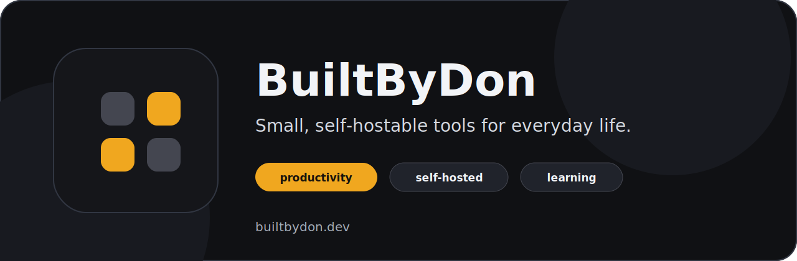

  

  <a href="https://builtbydon.dev"><strong>Website</strong></a>
  &nbsp;|&nbsp;
  <a href="https://builtbydon.dev/contact.html"><strong>Contact</strong></a>
  &nbsp;|&nbsp;
  <a href="https://github.com/builtbydon?tab=repositories"><strong>Projects</strong></a>

---

## What I build

Small, self-hostable tools for productivity, life management, and learning.

I like software that is practical, quiet, and useful enough to earn a real place
in your routine. The focus is on tools you can run yourself, understand, and keep
close to your own data.

| Focus | Direction |
| --- | --- |
| Personal finance | Local-first tracking, planning, and everyday money clarity |
| Media and organization | Tools for managing collections, routines, and household systems |
| Learning | Apps for practice, review, and steady progress |
| Self-hosting | Clean public releases with clear setup paths |

## Principles

- Self-hostable first
- Plain setup instructions
- Private by default when possible
- No surprise accounts
- Clear disclosure when a project needs Claude or another paid tool

## Current status

The public catalog is just getting started. Repositories will appear here as
cleaned, self-hostable mirrors are published from the private source work.

Some projects can run through your own Claude subscription with headless Claude
Code. When that is required, the repo README will say so directly.

---

  
  

